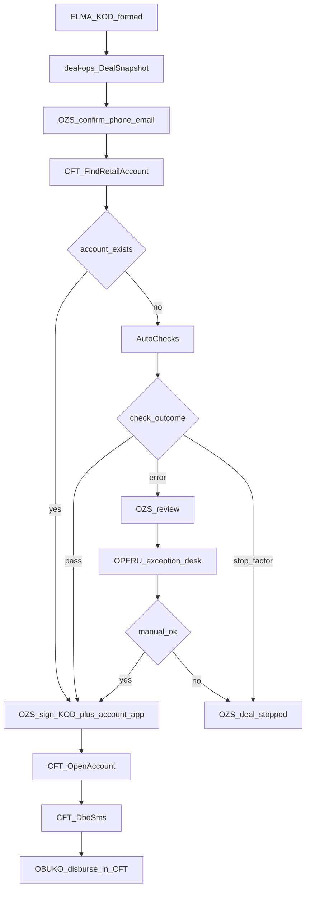
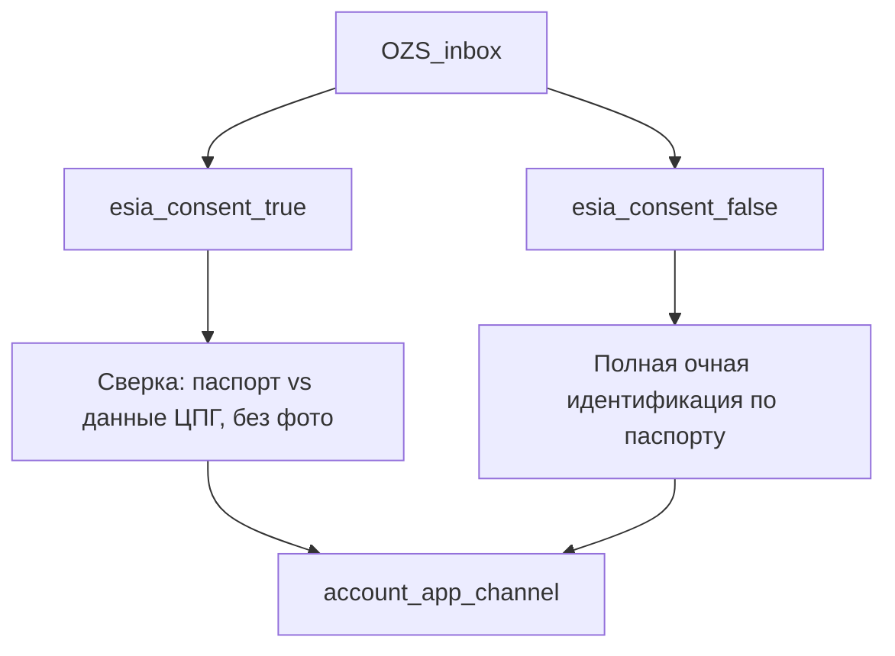

# Открытие счёта: sidecar после КОД (`deal-ops`)

Ранний кусок strangler **этапа 4** (сделка / ЦФТ / ОЗС / ОПЕРУ). Пока ELMA ведёт заявку до «КОД сформирован», офисное открытие счёта живёт в отдельном сервисе `deal-ops` и АРМ банка. Контракт снимка и события ЦФТ без переписывания входят в Conveyor.

Связанные документы: [strangler](./elma-strangler.md), [процесс](./to-be-process.md), [адаптеры](./to-be-integrations.md), [ландшафт](./to-be-overview.md).

Источники AS-IS офиса: БТ «Автоматизация открытия счета» (06.08.2026), Visio «Логика открытия счета _ итог» (22.07.2026), план MPP через ОПЕРУ (01.06–30.09.2026).

**Не делать:** новые BPM-проверки, шаблон заявления, подтверждение телефона и ручное открытие счёта **в ELMA**. Из `.mpp` в ELMA оставляем только экспорт снимка и приём callback-статуса. Задачи ЦФТ (событие, автооткрытие, СМС ДБО) остаются у АБС.

---

## 1. Проблема AS-IS в офисе

Конвейер обрывается, когда клиент приходит на сделку. Данные ELMA (паспорт, СОПД, идентификация, телефон) **перестают быть входом** в открытие счёта.

1. ОЗС заново проверяет паспорт и переподписывает СОПД (часто с датой визита, не акцепта).
2. Клиент берёт талон ОПЕРУ, снова паспорт, ручные сайты ФНС / МВД / Федресурс / ФТС.
3. ОПЕРУ печатает заявление, открывает счёт в ЦФТ, выдаёт логин/пароль ДБО.
4. Клиент возвращается к ОЗС подписывать КОД. ОБУКО переводит на этот счёт (до или после госрегистрации залога).

Дубль идентификации ОЗС→ОПЕРУ, рассинхрон карточки, норматив сделки 45 минут, из них ~30 на очередь ОПЕРУ.

---

## 2. Целевой офисный поток

Клиент сидит у ОЗС. Второго окна нет. Паспорт сверяют со **снимком**, не набивают заново. СОПД не переподписывают: отдельного согласия на счёт нет (комментарий в плане проекта). Автопроверки до подписания. Заявление на счёт из тех же данных. ЦФТ открывает счёт по **`KodSigned`**. СМС на ДБО. ОБУКО выдаёт в ЦФТ на известный счёт.



Ветка «счёт уже есть»: стандартный КОД **без** заявления на открытие, деньги на существующий счёт. Электронное подписание кладёт заявление в пакет КОД; бумага — ОЗС печатает из АРМ.

Идентификация 115-ФЗ остаётся **личной сверкой ОЗС со снимком**, не вторым контуром ОПЕРУ. Расхождение паспорта → `CorrectPassportData` (ОБУКО в ЦФТ), не новая анкета.

---

## 3. Границы сервиса

| Владеет | Не владеет |
|---------|------------|
| Снимок сделки после КОД, inbox ОЗС/ОПЕРУ | АНД, АПЗ, СБ, паспорт сделки, сбор документов |
| Автопроверки открытия счёта, заявление | Скоринг Loginom, Solver |
| Подтверждение телефона/email для ДБО | Перевод денег (ОБУКО в ЦФТ) |
| Триггер `KodSigned` в ЦФТ, контроль «ДБО открыт» | Каталог пользователей ЛК (`elma_id`) |
| Callback статуса в ELMA | Новые процессы ELMA |

`deal-ops` — bounded context Conveyor (`stage` `kod` → `signing` → `issue`), не третья BPMS. IAM — каталог банка, роли `deal_officer` (ОЗС) и `operu` (только exception desk).

Макет АРМ (лаб, мок-данные и анимация интеграций): https://aleshafaceman.github.io/bgfbank-credit-conveyor-lab/deal-ops/

---

## 4. Контракт снимка ELMA → `deal-ops`

Триггер экспорта: стадия «КОД сформирован / готов к подписанию» (ELMA 28 / Conveyor `kod_forming` → готовность пакета), **не** визит клиента. Повторный экспорт с тем же `deal_id` — upsert, не вторая сделка.

`deal_id` = номер заявки БЖФ (`25BGFB…`). ELMA **не** запускает проверки, не рисует заявление, не открывает счёт.

Минимальная доработка ELMA:

1. Исходящий `POST` на `deal-ops` (или файл + API-заглушка на пилоте) с телом ниже.
2. Входящий callback статусов — запись в карточку / историю заявки **без** новых пользовательских задач «проверь ИНН».

### 4.1 JSON снимка

```json
{
  "schema_version": "1.0",
  "exported_at": "2026-03-24T12:39:00+03:00",
  "source": "elma",
  "deal_id": "25BGFB00000000",
  "elma_sale_uid": "00000000-0000-0000-0000-000000000000",
  "lead_created_at": "2026-03-10T09:14:00+03:00",
  "required_sopd_form": "full",
  "esia_consent": true,
  "application": {
    "product_name": "string",
    "credit_purpose": "cash_on_pledge",
    "amount": "5686890.00",
    "currency": "RUB",
    "term_months": 182,
    "disbursement": "before_state_registration",
    "signing_channel": "paper",
    "region_code": "77"
  },
  "clients": [
    {
      "role": "borrower",
      "verified_via": "esia",
      "full_name": "string",
      "birth_date": "1970-01-01",
      "gender": "male",
      "inn": "000000000000",
      "snils": "000-000-000 00",
      "phone": "+70000000000",
      "email": "user@example.com",
      "id_client_cft": "optional-string",
      "passport": {
        "series": "0000",
        "number": "000000",
        "issued_at": "2010-01-01",
        "issued_by": "string",
        "division_code": "000-000"
      }
    }
  ],
  "consents": [
    {
      "consent_id": "uuid-or-elma-id",
      "type": "PERSONAL_DATA",
      "form": "full",
      "version": "банк 2026.2 полная",
      "accepted_at": "2026-03-11T16:49:00+03:00",
      "valid_until": "2031-03-11",
      "channel": "sms",
      "file_name": "SOPD-deal-first.pdf"
    }
  ],
  "esia_purposes": [
    { "code": "CPG_FIN", "title": "Финансовые услуги", "accepted_at": "2026-03-11T16:50:00+03:00" },
    { "code": "CPG_NONFIN", "title": "Нефинансовые услуги", "accepted_at": "2026-03-11T16:50:00+03:00" },
    { "code": "CPG_BKI", "title": "Запрос кредитного отчёта", "accepted_at": "2026-03-11T16:50:00+03:00" }
  ],
  "additional_conditions": [
    { "id": "du_18", "elma_type": 18, "title": "Предоставить нотариальное согласие супруга", "when": "signing" }
  ],
  "kod": {
    "ready_at": "2026-03-24T13:27:00+03:00",
    "documents": [
      {
        "code": "credit_agreement",
        "title": "Кредитный договор",
        "file_url": "https://elma.example/files/..."
      }
    ]
  },
  "account_open_when": "after_kod",
  "retail_account": {
    "status": "reserved",
    "known_in_elma": false,
    "cft_account_id": "40817810100000007701"
  }
}
```

`disbursement`: `before_state_registration` | `after_state_registration`.  
`signing_channel`: `paper` | `smartdeal`. В АРМ это **вид сделки**: бумажная | электронная. SmartDeal — канал электронной сделки, не название вида и **не** этап электронной регистрации в Росреестре. Для электронной: если УКЭП уже есть — `RequestUkep` не вызываем; иначе заявление на УКЭП → выпуск. Дальше `CreateSigningPackage` → `StartSigning` (клиент) → подпись банка → `SigningCompleted` → ЦФТ `KodSigned`. На бумаге: печать и сшив до подписи, SmartDeal не вызывается, сканы после подписи до конца следующего рабочего дня.  
`account_open_when`: `before_kod` | `after_kod` (Visio: счёт до или после подписи КОД). Стол может переключить, пока счёт не открыт.  
`retail_account.status`: `none` | `reserved` | `open`. `reserved` — объект с подготовки этапа 3 («к подписанию»), это ещё не открытый счёт: проверки открытия и заявление всё равно нужны. `open` — ветка без заявления на открытие.  
`credit_purpose`: как `CreditPurposeEnum` (`mortgage` / `cash_on_pledge` / `refinancing`).  
`esia_consent`: флаг **с заявки**, не повторный вход в Госуслуги за столом.  
`clients[].verified_via`: `esia` | `manual` (канон формы / ЦПГ).  
`additional_conditions[].elma_type`: `ElmaAdditionalConditionTypeEnum` 0–18. Заголовок в АРМ — комментарий к значению enum, не свободный текст.  
`additional_conditions[].when`: `signing` (снять до подписи КОД) | `issue` (можно на выдачу / аккредитив, как Visio). Это флаг экземпляра, не отдельное поле enum; тип 14 по названию — «Погашение после сделки».  
`lead_created_at`: дата создания **лида** в ELMA (первое касание). В АРМ показывается, **в шаблон СОПД не подставляется**.  
`consents[]` первого СОПД: `form` `short` | `full`, `version`, `accepted_at`, `valid_until`, файл для проверки. `channel` — **как получили** первое СОПД, не ЕСИА: `partner` (короткая с партнёром), `manager` (полная, бумага с менеджером), `sms` (полная электронная: SMS → клиент заполняет и подписывает). Требуемая для сделки форма — `required_sopd_form` (сейчас `full`). Канал СОПД и `esia_consent` независимы.  
Созаёмщики — дополнительные объекты в `clients` с `role: co_borrower`.

АРМ показывает первое СОПД и даёт **скачать/проверить** подписанный файл. **Шаблон полной для подписания** — только если первое недостаточно: короткая форма, истёк срок или чужая версия. Каналы добора полной: SMS (форма клиента `sopd-app.html`, как заявление на счёт) или бумага за столом. Если полная действует (менеджер/бумага или SMS/электронная) — шаблон скрыт. Дата лида в шаблон не идёт. Отдельного согласия на счёт нет. Поиск счёта в ЦФТ недоступен, пока первое СОПД недостаточно. Если паспорт в окне ≠ данные снимка сделки (ФИО/паспорт из ЦПГ или анкеты, **без фото ЕСИА**) — задача `cfo_obuko` / `CorrectPassportData`, снимок после правки перечитывается из ЦФТ+ELMA, не из ручного ввода ОПЕРУ.

### 4.1.1 ЕСИА на АРМ и два канала заявления

Регламенты УЗС / заключения сделки / подготовки КОД и Visio конвейера **не знают ЕСИА на сделке**: идентификация очная, заявление на счёт печатает ОПЕРУ/ЦФТ. В sidecar это не возвращает второе окно. ЕСИА на АРМ — только `esia_consent` / `verified_via` из снимка.



| Когорта | Идентификация ОЗС | Дефолт заявления на счёт |
|---------|-------------------|--------------------------|
| `esia_consent: true` | Признак **ЕСИА: да** всегда на карточке. Явка + сверка паспорта с **текстовыми данными** цифрового профиля (`CPG_FIN` / `NONFIN` / `BKI` с датами). Фото в ЕСИА нет. Повторного Госуслуг нет | `sms` — ссылка на электронную форму |
| `esia_consent: false` | Признак **ЕСИА: нет** всегда на карточке. Очная сверка паспорта со снимком сделки (анкета ELMA, данные документа, не фото ЦПГ) | `paper` — печать шаблона + загрузка скана |

SMS-форма **не** равна ЕСИА: OTP на телефон сделки можно дать и клиенту без Госуслуг. Бумагу можно дать клиенту с ЕСИА. Если `retail_account` уже есть — заявление на **открытие** не требуется; заявление на ДБО + приложение 1 (безакцепт) остаётся отдельным документом.

Каналы одного заявления:

- **A. `sms`.** События `AccountAppLinkSent` → `AccountAppSigned`. Клиент открывает форму по токену сделки, видит предзаполненные ФИО/паспорт/сумму, подписывает простой жест (OTP).
- **B. `paper`.** Печать из снимка (AS-IS «распечатать → скан в ELMA»). Статус `uploaded` по факту файла.

Подписание **КОД** не смешивается с заявлением на счёт. Visio: счёт **до** подписи КОД или **после**. ЦФТ `OpenAccount` — после подписанного заявления; момент относительно `KodSigned` задаёт `account_open_when`. Заявление на ДБО + приложение 1 — отдельный документ: без него стол не закрывает шаг ДБО.

Что из Visio/инструкции УЗС **остаётся чеклистом ОЗС** в карточке (не отдельным окном ОПЕРУ): ДУ к снятию; комплект КОД + канал `paper` | `smartdeal`; заявления РКО (счёт и ДБО); печать/сшив на бумаге; сканы подписанного до конца следующего рабочего дня; выдача до/после госрегистрации; возврат на процессинг КОД; отказ клиента от подписи.

Что **не** в этом срезе АРМ: календарь паспорта сделки, процессинг КОД (ОПС), обращение в Росреестр / электронная закладная, окно ОПЕРУ как второе рабочее место.

### 4.2 Callback `deal-ops` → ELMA

`POST` на endpoint ELMA (или шина банка). Идемпотентность: `deal_id` + `status` + `occurred_at`.

| `status` | Когда | Что делает ELMA |
|----------|--------|-----------------|
| `snapshot_received` | снимок принят | история; заявка остаётся в «подготовка/заключение» |
| `phone_confirmed` | ОЗС подтвердил телефон (и email, если был) | записать контакты ДБО, **не** новую задачу |
| `account_exists` | `FindRetailAccount` нашёл счёт | ветка без заявления |
| `checks_running` | старт автопроверок | опционально, без inbox |
| `checks_passed` | все обязательные проверки `pass` | можно заявление на счёт и дальше КОД |
| `account_app_link_sent` | SMS со ссылкой на электронную форму | история; не задача ELMA |
| `account_app_signed` | форма подписана или скан загружен | можно подписывать КОД |
| `sopd_full_signed` | полная форма СОПД подписана (SMS или бумага за столом) | первое СОПД достаточное |
| `checks_operu` | есть `error`, нет `stop_factor` | **не** создавать задачу ОПЕРУ в ELMA — очередь в АРМ `deal-ops` |
| `stop_factor` | критический отказ проверок | ОЗС разворот; ELMA — отказ/стоп сделки по существующему сценарию |
| `operu_approved` / `operu_rejected` | исход exception desk | rejected → тот же стоп, что `stop_factor` |
| `signing_completed` | КОД (± заявление) подписан | это **`KodSigned`**; ELMA не открывает счёт |
| `kod_revision` | ОЗС вернул комплект на правки | возврат на процессинг КОД (ELMA 30 / задача ОПС) |
| `client_refused` | отказ клиента от подписи | закрытие сделки, как ELMA 38 |
| `account_opened` | ЦФТ открыл счёт | номер счёта в карточке |
| `dbo_sms_sent` | СМС со ссылкой ушло | |
| `dbo_opened` | критерий ДБО выполнен | ОЗС может идти к выдаче |
| `deal_stopped` | ОЗС остановил сделку | закрытие / отказ клиента или банка |

ELMA **не** получает сырые HTML проверок и не маршрутизирует ОПЕРУ. Проекция партнёра по-прежнему через `Stage3ElmaCallBackSchema` / `elma_status_map`, пока кабинет жив: `signing_completed` → стадия подписания (ELMA 33), `account_opened` / выдача → 36/39 по факту ЦФТ.

---

## 5. Каталог проверок ОПЕРУ

AS-IS — ручные сайты из БТ. В прод **не парсить HTML**. Исходы как на Visio: `pass` | `error` (очередь ОПЕРУ до подписания) | `stop_factor` (разворот ОЗС).

Перечень стоп vs ошибка в БТ не зафиксирован; ниже — рабочая модель v1 до карточки аналитики. Меняет продукт + комплаенс, не разработчик в одиночку.

| Код | Что проверяем | AS-IS URL | Канал v1 | `stop_factor` | `error` |
|-----|---------------|-----------|----------|---------------|---------|
| `inn` | ИНН ФЛ | `service.nalog.ru/inn.do` | СМЭВ/ФНС API **или** витрина ЦФТ, если уже есть. Сайт — запрещён | ИНН не соответствует ФИО/ДР после ручной сверки ОПЕРУ | таймаут, недоступность, пустой ответ |
| `fns_suspension` | приостановления ИФНС | `service.nalog.ru/bi.do` | то же | действующее приостановление по клиенту | сбой сервиса |
| `passport_valid` | действительность паспорта | «отдельный сервис», URL нет — spike | СМЭВ МВД «действительность паспорта». Пока нет API — **ручной v1** в очереди ОПЕРУ с паспортом из снимка (не повторный ввод) | недействителен / числится в розыске | сервис недоступен |
| `bankruptcy` | банкротство | `bankrot.fedresurs.ru` | Федресурс API / СМЭВ **или** ЦФТ | найденная процедура банкротства | сбой |
| `rkl` | перечень РКЛ МВД | `мвд.рф/rkl`; БТ: **также проверяет ЦФТ** | **только ЦФТ** как источник правды; отдельный запрос на сайт МВД не делаем | попадание в РКЛ | ЦФТ не ответил — `error`, повтор/ОПЕРУ |
| `customs_debt` | задолженность ФТС | `edata.customs.ru/.../CheckPayments` | API ФТС/СМЭВ если дадут; иначе **ручной v1** | продуктово: существенный долг (порог — комплаенс) | сбой; долг ниже порога — `pass` с предупреждением в АРМ |

Правила оркестратора:

1. Все шесть ставятся в outbox **параллельно** после `FindRetailAccount` = нет счёта. Если счёт есть — проверки открытия **не** гоняем.
2. Любой `stop_factor` → `status=stop_factor`, подписание закрыто.
3. Только `error` (нет стопа) → `checks_operu`, inbox `operu`. ОПЕРУ видит снимок и сырой результат адаптера, **не** просит паспорт заново.
4. РКЛ: если ЦФТ `pass`, а внешний контур (если появится) `stop` — `CftSyncMismatch`, человек, не автоотказ.
5. UI АРМ проверки не вызывает.

Spike до разработки: паспортный сервис и наличие тех же проверок внутри ЦФТ РКО — чтобы не дублировать РКЛ и по возможности ИНН.

---

## 6. ЦФТ: доменный минимум (имена до сверки с ИТ АБС)

Секретный SOAP/API АБС в этом документе не копируем. Смысл команд фиксирован; vendor-имена подставляет адаптер после сверки с ИТ ЦФТ. Триггер в БТ — **«КОД подписан»**, не «договор подписан» из Visio/MPP (БТ новее).

Каждая команда: `deal_id` / `application_id`, `cft_client_id` если есть, `idempotency_key`.

| Команда | Когда | Смысл |
|---------|--------|--------|
| `FindRetailAccount` | после подтверждения телефона, до заявления | есть ли счёт РКО у клиента |
| `KodSigned` | ОЗС завершил подписание КОД (± заявление) | факт для АБС; **не** синоним «деньги выданы» |
| `OpenAccount` | `KodSigned` и счёта не было | идемпотентное открытие; заявление уже подписано |
| `DboSms` | счёт открыт (новый или существующий — по продукту: существующий может уже иметь ДБО) | СМС со ссылкой; номер = подтверждённый ОЗС |

Уже существующие команды адаптера ([to-be-integrations.md](./to-be-integrations.md)): `CheckData`, `UpsertClient` (карточка к КОД **до** офиса), `CreateCreditContract`, `OpenLetterOfCredit`, `RegisterMortgageNote`, `SendRefusal`, `CorrectPassportData`.

События:

- `RetailAccountFound` / `RetailAccountAbsent`
- `KodSignedAck`
- `AccountOpened` (`cft_account_id`)
- `DboSmsSent`
- `DboOpened` (если ЦФТ умеет сказать; иначе ОЗС ставит вручную по факту в офисе)
- `CftSyncMismatch`
- `AccountAppLinkSent` / `AccountAppSigned` (канал `sms`; для `paper` достаточно факта `uploaded` в АРМ)

Если ЦФТ принимает только текст «договор подписан» — адаптер мапит `KodSigned` → vendor event, в домене БЖФ имя остаётся `KodSigned`.

Критерий «ДБО открыт» (открытый стык БТ): предпочтительно событие ЦФТ; fallback — чекбокс ОЗС с аудитом. Если клиент не открыл в офисе: сделка подписана, счёт есть, выдача ОБУКО не блокируется ДБО **пока продукт не скажет иначе**; ОЗС видит предупреждение.

---

## 7. АРМ

Один сервис, два inbox, без талона во второе окно.

**ОЗС (`deal_officer`):** очередь с фильтром Все / ЕСИА / без ЕСИА; карточка снимка; идентификация по ветке `esia_consent`; первое СОПД; чеклист ДУ; статус счёта ЦФТ (`none` / `reserved` / `open`); подтверждение телефона; лента проверок; заявление на счёт (`sms` или `paper`) и момент открытия (`before_kod` / `after_kod`); комплект КОД (бумага: сшив, сканы после; электронная: УКЭП есть или выпуск, подпись клиента и банка, без обращения в Росреестр); заявление ДБО + приложение 1; подписание; возврат на процессинг / отказ клиента; контроль ДБО.

Порядок карточки: снимок → идентификация → ДУ → поиск счёта в ЦФТ → автопроверки (если счёт не `open`) → заявление на счёт → (опционально открыть счёт) → КОД → ДБО.

**ОПЕРУ (`operu`):** только `checks_operu`. Согласовать (возврат ОЗС на заявление) / отказать (`stop_factor`). Нет маршрута «набей клиента с нуля» и нет второго окна для клиента. Макет: очередь появляется, когда проверка дала `error` (сделка `…004`, ИНН).

**ОБУКО:** ЦФТ, выдача на `cft_account_id`.

Макет клиента (SMS-ссылка заявления на счёт): https://aleshafaceman.github.io/bgfbank-credit-conveyor-lab/deal-ops/account-app.html  
Макет полной СОПД по SMS: https://aleshafaceman.github.io/bgfbank-credit-conveyor-lab/deal-ops/sopd-app.html

---

## 8. Фазы поставки

1. Контракт снимка + запись в `deal-ops` (допустима заглушка API).
2. АРМ ОЗС: снимок, контакты, проверка первого СОПД / шаблон полной формы, ветка «счёт есть».
3. Автопроверки + очередь ОПЕРУ + стоп-факторы.
4. Заявление; подписание; электронная — шина SmartDeal, затем `KodSigned` → `OpenAccount` → `DboSms`; бумага — сразу `KodSigned`.
5. Callback в ELMA; выдача ОБУКО без второго окна; замер минут в офисе.

Орг. хвост из MPP вне кода: ДИ ОЗС, доверенности, ВНД, обучение ОПЕРУ на exception desk.

---

## 9. Стык с Conveyor

Когда этап 4 заберёт паспорт/КОД из ELMA, источник снимка меняется с `source: elma` на агрегат Conveyor. Поля §4.1, команды §6 и АРМ §7 не меняются. Флаг заявки `orchestration_backend` / `deal_backend = elma | deal-ops | conveyor`.
