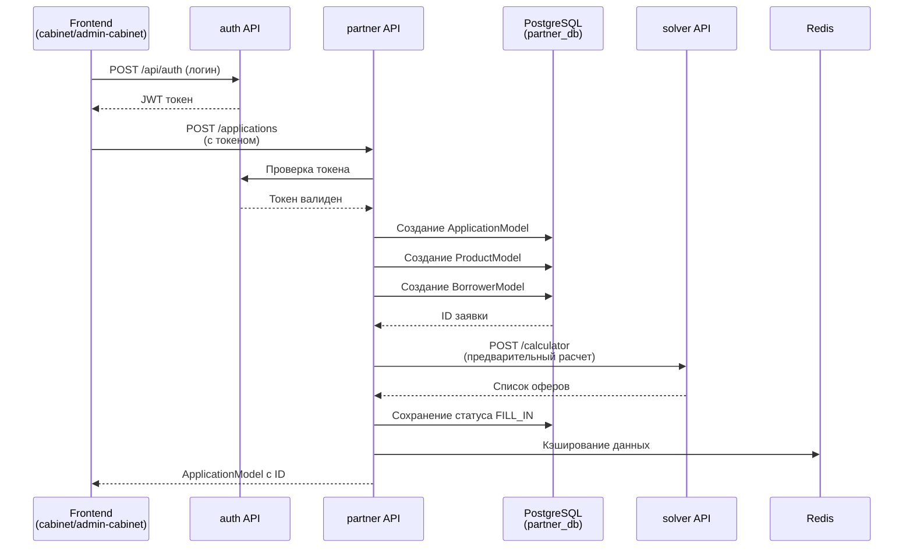
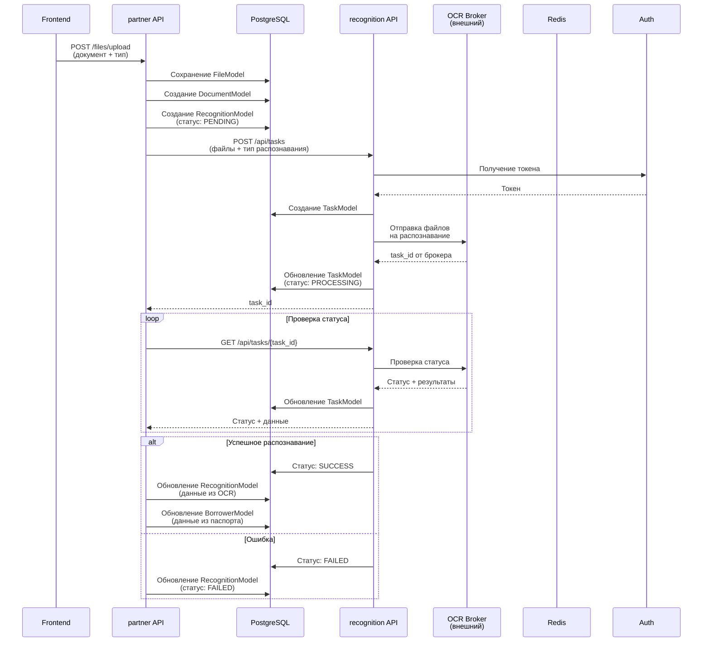
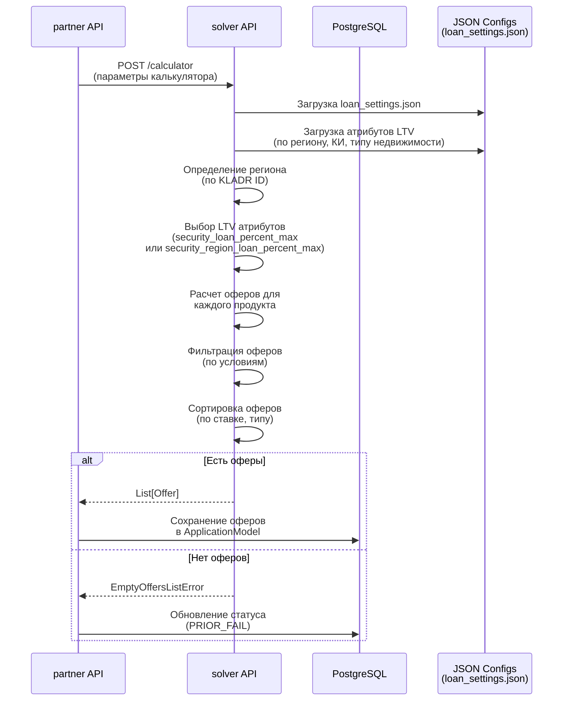
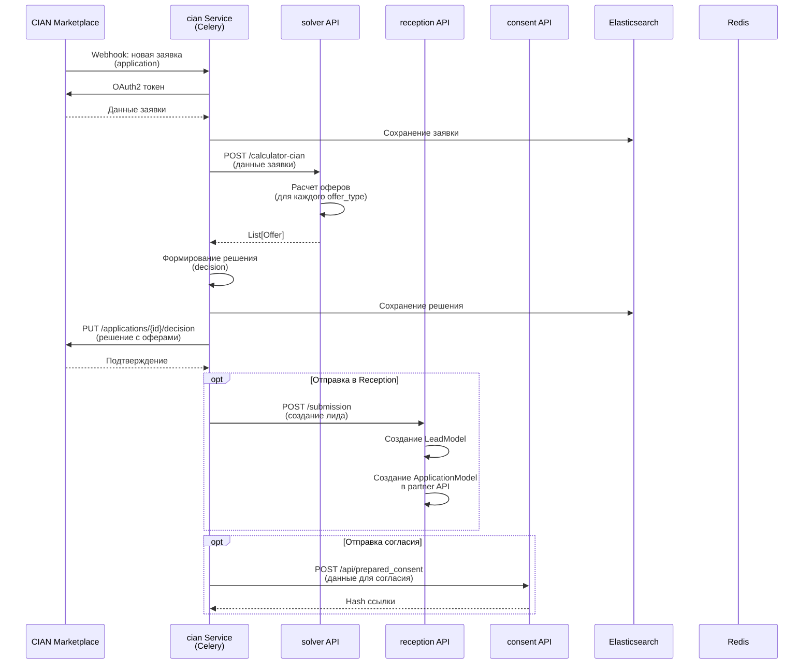
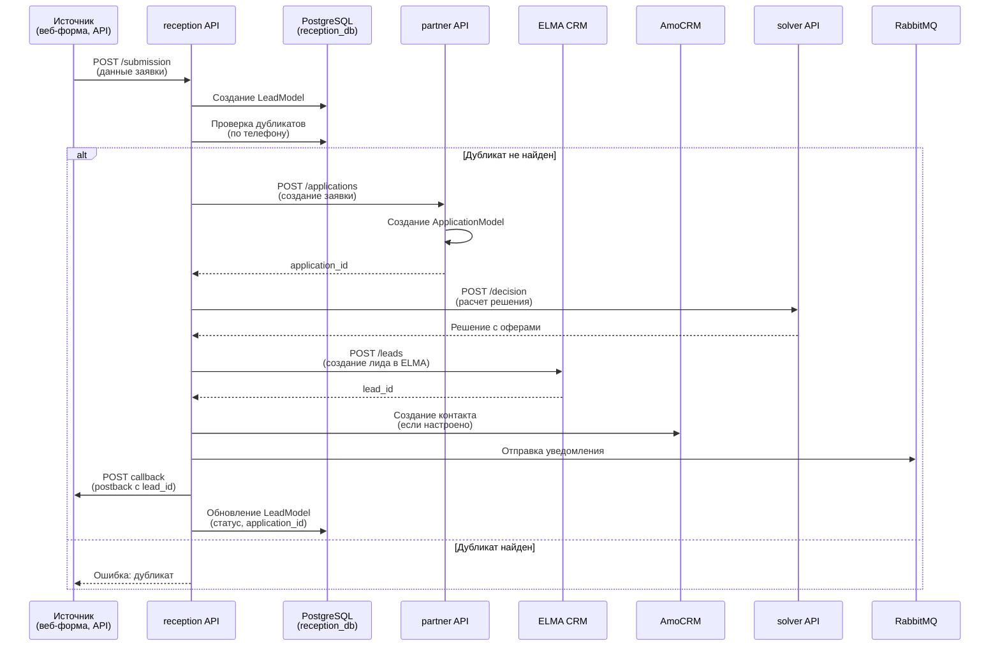
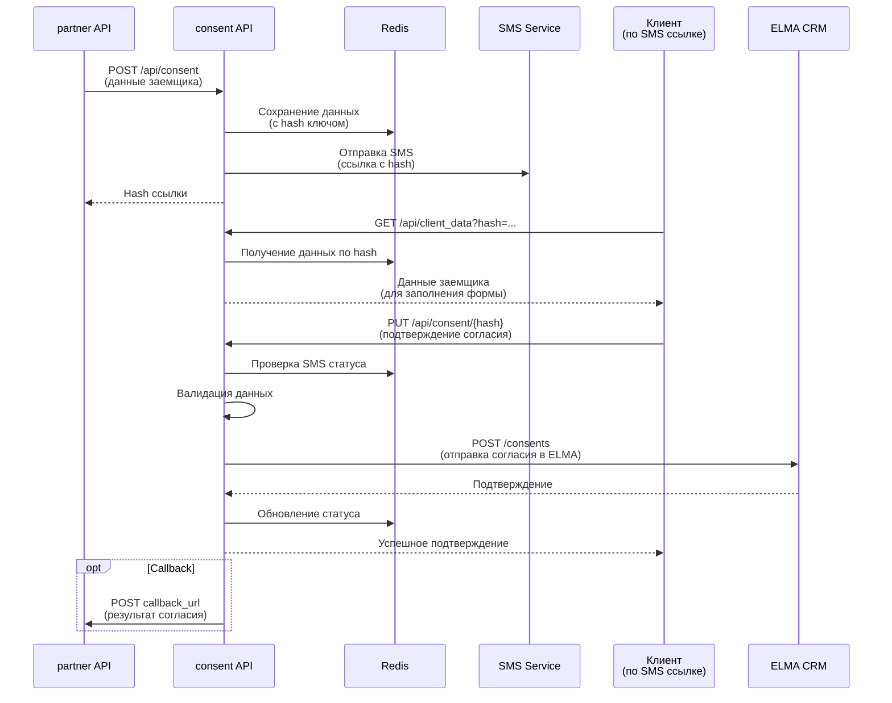
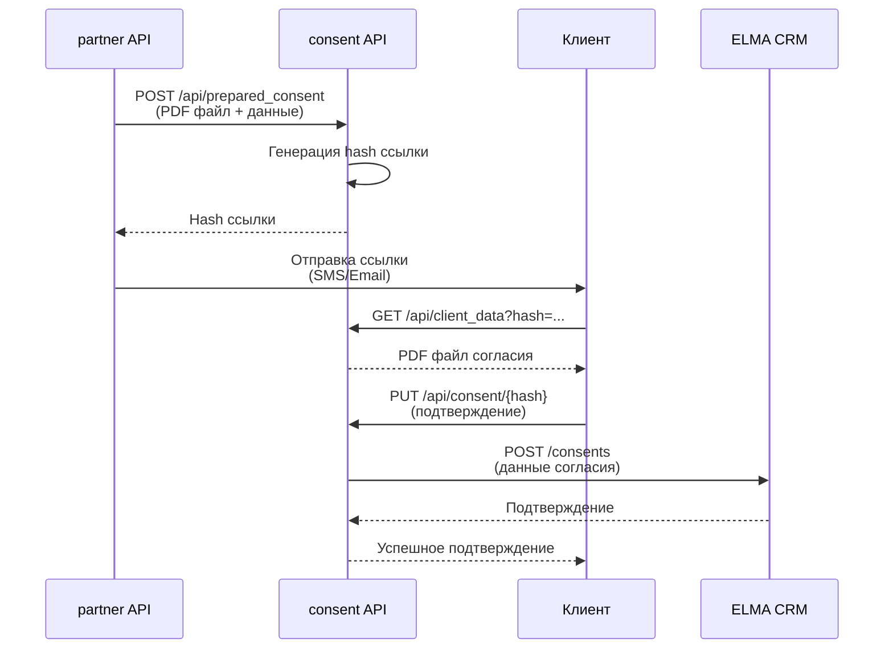
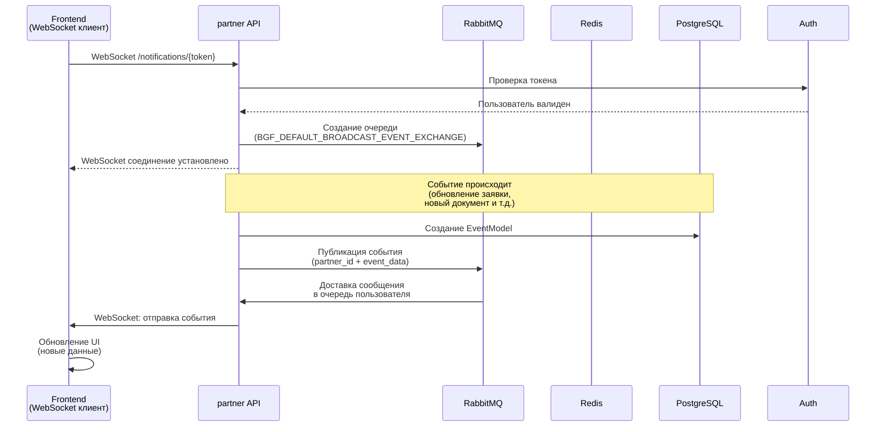

# Потоки данных в системе Банка жилищного финансирования

Данный документ описывает основные потоки данных между сервисами системы Банка жилищного финансирования (BGF).

## Содержание

1. [Создание заявки партнером](#1-создание-заявки-партнером)
2. [Обработка документов и распознавание](#2-обработка-документов-и-распознавание)
3. [Расчет кредитных предложений](#3-расчет-кредитных-предложений)
4. [Интеграция с CIAN](#4-интеграция-с-cian)
5. [Обработка заявок через Reception](#5-обработка-заявок-через-reception)
6. [Работа с согласиями](#6-работа-с-согласиями)
7. [Уведомления в реальном времени](#7-уведомления-в-реальном-времени)

---

## 1. Создание заявки партнером

### Описание
Партнер создает новую заявку через фронтенд, заполняет данные заемщика и продукта.

### Схема потока



### Детали процесса

1. **Аутентификация**: Пользователь логинится через `auth` API, получает JWT токен
2. **Создание заявки**: 
   - Создается `ApplicationModel` со статусом `FILL_IN`
   - Создается связанный `ProductModel` (продукт кредита)
   - Создается `BorrowerModel` (заемщик)
3. **Предварительный расчет**: Опционально вызывается `solver` для предварительного расчета оферов
4. **Сохранение**: Все данные сохраняются в `partner_db`

### Статусы заявки

- `FILL_IN` - заполняется
- `PRIOR_PROCESSING` - предварительная обработка
- `PRIOR_APPROVE` - предварительно одобрена
- `PRIOR_FAIL` - предварительно неодобрена
- `APPLICATION_SENT` - заявка отправлена
- `PROCESSING` - обрабатывается
- `ACCEPTED` - одобрена
- `DECLINE` - отказ

---

## 2. Обработка документов и распознавание

### Описание
Партнер загружает документы (паспорт, ЕГРН и т.д.), которые отправляются на распознавание через `recognition` API.

### Схема потока



### Типы документов

- `passport` - паспорт (распознавание типа 0)
- `egrn` - выписка ЕГРН (распознавание типа 2)
- `undefined` - прочие документы (распознавание типа 1)

### Статусы распознавания

- `PENDING` - ожидает обработки
- `PROCESSING` - обрабатывается
- `SUCCESS` - успешно распознано
- `FAILED` - ошибка распознавания

### Особенности

- Поддержка автоматического и ручного режимов распознавания
- Автоматический режим: проверка каждую секунду, ожидание до 60 секунд
- Ручной режим: проверка каждые 10 секунд, ожидание до 15 минут
- Поддержка форматов: BMP, JPEG, PNG, TIFF, PDF

---

## 3. Расчет кредитных предложений

### Описание
Расчет кредитных предложений (оферов) на основе данных заявки, региона, кредитной истории и других параметров.

### Схема потока



### Параметры расчета

**Входные параметры:**
- `application_id` - ID заявки
- `product_category` - категория продукта (LOAN, MORTGAGE)
- `credit_history` - кредитная история (K1-K5)
- `property_type` - тип недвижимости (FLAT, APARTMENT, COMMERCIAL)
- `building_price` - стоимость недвижимости
- `region_kladr_id` - KLADR ID региона
- `loan_amount` - желаемая сумма кредита
- `loan_term` - срок кредита

**Выходные данные (Offer):**
- `code` - код продукта
- `rate` - процентная ставка
- `minInitialPayment` - минимальный первоначальный взнос
- `maxAmount` - максимальная сумма кредита
- `minTerm`, `maxTerm` - минимальный и максимальный срок
- `requirements` - требования к заемщику

### Факторы влияния на LTV

1. **Регион**: Москва, МО, СПб, ЛО, регионы
2. **Кредитная история**: K1 (57-70%), K2 (52-65%), K3 (40-65%), K4 (40-60%), K5 (35-57%)
3. **Тип недвижимости**: квартира (35-70%), апартаменты (35-60%), коммерческая (35-60%)
4. **Расстояние до МКАД/КАД**: для МО и ЛО
5. **Специальные условия**: первый этаж, "Кредит для своих"

### Пример расчета

Для Москвы, КИ=K5, квартира:
- `security_loan_percent_max = 0.57` (57%)
- `maxAmount = building_price × 0.57`
- `minInitialPayment = 1 - 0.57 = 0.43` (43%)

---

## 4. Интеграция с CIAN

### Описание
Синхронизация заявок с маркетплейсом CIAN: получение заявок, расчет решений, отправка оферов обратно в CIAN.

### Схема потока



### Процесс обработки заявки CIAN

1. **Получение заявки**: CIAN отправляет webhook о новой заявке
2. **Получение данных**: Celery задача получает полные данные заявки через CIAN API
3. **Расчет решений**: 
   - Для каждого `offer_type` вызывается `solver` API
   - Формируется список оферов
   - Статус: `APPROVE` (есть оферы) или `NO_DECISION`
4. **Отправка решения**: Решение с оферами отправляется обратно в CIAN
5. **Создание лида**: Опционально создается лид в `reception` API
6. **Согласие**: Опционально отправляется запрос на создание согласия

### Типы заявок CIAN

- **Application** - полная заявка с данными клиента
- **Submission** - упрощенная заявка (submission)

### Хранение данных

- **Elasticsearch**: хранение заявок и решений для аналитики
- **Redis**: кэширование данных с задержкой сохранения

---

## 5. Обработка заявок через Reception

### Описание
Прием заявок из различных источников (веб-формы, интеграции), создание лидов и заявок в partner API.

### Схема потока



### Источники заявок

1. **Веб-формы**: прямые заявки с сайта
2. **Call Center**: заявки от операторов
3. **Email-лиды**: обработка писем (через Celery)
4. **Внешние API**: интеграции с партнерами
5. **CIAN**: заявки от маркетплейса CIAN

### Интеграции

**ELMA CRM:**
- Создание лида в ELMA
- Отправка данных заявки
- Получение статусов из ELMA
- Отправка промежутков времени для сделки

**AmoCRM:**
- Создание контакта
- Создание сделки
- Синхронизация статусов

**Call Center:**
- Интеграция с колл-центром
- Передача данных операторам

### Статусы лида

- `NEW` - новый лид
- `PROCESSING` - обрабатывается
- `CONVERTED` - конвертирован в заявку
- `REJECTED` - отклонен

---

## 6. Работа с согласиями

### Описание
Процесс создания, отправки и обработки согласий на обработку персональных данных.

### Схема потока (SMS согласие)



### Схема потока (подготовленное согласие)



### Типы согласий

1. **По телефону (SMS)**: 
   - Клиент получает SMS со ссылкой
   - Заполняет форму на сайте
   - Подтверждает согласие

2. **Подготовленное согласие**:
   - Partner API отправляет готовый PDF
   - Клиент получает ссылку для просмотра
   - Подтверждает согласие

3. **Бумажное согласие**:
   - Загружается отсканированное согласие
   - Обрабатывается через recognition API

### Данные согласия

- ФИО заемщика
- Паспортные данные
- Номер телефона
- Типы согласий (`agreement_signed_types`)
- IP адрес подписания
- Время получения и истечения

---

## 7. Уведомления в реальном времени

### Описание
Система уведомлений через WebSocket для обновлений заявок, документов и других событий в реальном времени.

### Схема потока



### Типы событий

- `application.updated` - обновление заявки
- `application.status_changed` - изменение статуса
- `document.uploaded` - загрузка документа
- `document.recognized` - завершение распознавания
- `borrower.updated` - обновление заемщика
- `product.updated` - обновление продукта
- `consent.sent` - отправка согласия
- `consent.accepted` - принятие согласия

### Механизм работы

1. **Подключение**: Клиент открывает WebSocket соединение с токеном авторизации
2. **Создание очереди**: Для каждого пользователя создается уникальная очередь в RabbitMQ
3. **Публикация событий**: При наступлении события оно публикуется в RabbitMQ exchange
4. **Фильтрация**: Сообщения фильтруются по `partner_id` - пользователь получает только свои события
5. **Доставка**: Сообщения доставляются через WebSocket в реальном времени
6. **Таймаут**: Соединение закрывается через 5 минут (клиент переподключается)

### Формат сообщения

```json
{
  "event": {
    "type": "application.updated",
    "data": {
      "application_id": "uuid",
      "status": "PRIOR_APPROVE",
      "updated_at": "2024-01-01T12:00:00Z"
    }
  },
  "partner_id": 123
}
```

---

## Общие принципы потоков данных

### Аутентификация
- Все межсервисные запросы используют JWT токены
- Токены получаются через `auth` API
- Токены передаются в заголовке `x-token` или `Authorization`

### Обработка ошибок
- Все сервисы возвращают структурированные ошибки
- Ошибки логируются в Sentry
- При ошибках межсервисных запросов выполняется retry (где применимо)

### Асинхронность
- Тяжелые операции выполняются через Celery
- WebSocket для real-time уведомлений
- RabbitMQ для асинхронной обработки сообщений

### Кэширование
- Redis для кэширования часто запрашиваемых данных
- Кэширование результатов расчетов
- Кэширование токенов авторизации

### Логирование
- Структурированное логирование во всех сервисах
- Контекстные фильтры для трейсинга запросов
- Интеграция с Sentry для мониторинга ошибок

---

## Следующие шаги

Для более детального изучения:
- [Архитектурный обзор](./overview.md) — общая архитектура системы
- [Описание сервисов](./services.md) — детальное описание каждого сервиса
- [Бизнес-логика и данные](./business-logic-and-data.md) — детальное описание моделей данных и бизнес-правил
- [API документация](../api/) — документация API endpoints

