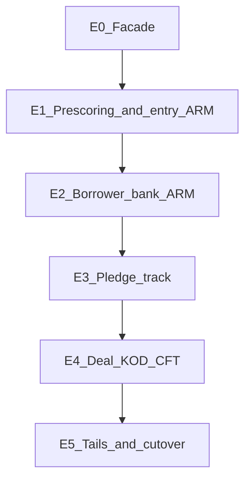

# Strangler ELMA: этапы 0–5 и карта методов → события Conveyor

Параллельная работа старого и нового контура обязательна: сделку и ЦФТ нельзя выключить разом.

Два контура **не делят IAM**. Новый вход — форма подачи + каталог Conveyor. ЛК продолжает логиниться через ELMA (`get_user_from_elma`) до этапа 5. Этап 0 (фасад) касается только легаси-вызовов partner/reception/consent, не авторизации новой формы.

Связанные документы: [ландшафт](./to-be-overview.md), [процесс](./to-be-process.md), [адаптеры](./to-be-integrations.md), [открытие счёта после КОД](./account-opening-strangler.md).

AS-IS каталог исходящих вызовов: [elma.yml](../../bgf-backend/partner/partner_api/etc/elma.yml). Входящие webhook'и: [elma/routes.py](../../bgf-backend/partner/partner_api/elma/routes.py).

## 1. Этап 0 — изоляция

**Цель.** Ни один сервис ЛК не ходит в ELMA напрямую.

1. Ввести `ConveyorGateway` с тем же смыслом операций, что ключи `elma.yml`.
2. Реализация `ElmaBackend` (текущий `real_elma`) и `ConveyorBackend` за одним интерфейсом.
3. Feature-flag на заявку или на канал: `integration.backend = elma | conveyor`.
4. Reception, consent, partner переключаются на gateway.

Критерий готовности этапа: смена URL ELMA не требует правок в `applications/tasks.py` / `consent_api/elma.py` / `reception_api/elma.py`.

На этапе 0 ConveyorBackend может проксировать в ELMA — это ещё не вынос процесса, только фасад.

## 2. Этапы выноса процесса

Критерий отключения ELMA на контуре: **0 новых задач** этой роли в ELMA за контрольный период + сверка статусов с ЦФТ (с этапа 4).

### Этап 1 — форма подачи (лаб → прод), не эволюция cabinet

- Отдельное приложение: форма клиента + АРМ продаж (UX из лаба). Свой IAM: OTP / ЕСИА, без `elma_id`.
- Прескоринг: Loginom + МО напрямую ([адаптеры](./to-be-integrations.md)).
- Исходы `PRIOR_*` пишет Conveyor. Проекция в B2B-кабинет — только если заявку ещё ведут в легаси.
- Stage-3 ещё в ELMA **для заявок, пришедших из cabinet**. Заявки формы подачи после прескоринга остаются в Conveyor (этап 2 подхватывает банковский АРМ).

Ценность: канал без каталога ELMA и снятие Loginom из пути новой заявки.

`CreatePartner` / аккредитация / логин ЛК на этом этапе **не трогаем** — это хвост этапа 5.

### Этап 2 — банковский АРМ, контур заёмщика

Очереди процессинга, АНД, СБ (клиентский контур), структуратор/КК по клиенту. Чек-листы ДУ и доработки без ELMA. Залог и сделка ещё в ELMA.

### Этап 3 — контур залога

Процессинг залога, АПЗ, единый МО, согласие с оценкой / независимый оценщик. Снятие `RequestExpressEvaluation`.

### Этап 4 — сделка

Паспорт, КОД, Smartdeal, ЦФТ, ОЗС/ОПЕРУ/ЦФО. После стабилизации выдачи — новые заявки не создают процессы ELMA.

**Ранний срез (можно до этапов 1–3):** сервис `deal-ops` забирает снимок, когда КОД уже сформирован в ELMA. Проверки открытия счёта, заявление, телефон/ДБО и АРМ ОЗС/ОПЕРУ **не** добавляются в ELMA. Контракт: [account-opening-strangler.md](./account-opening-strangler.md). Когда Conveyor заберёт паспорт/КОД, тот же bounded context становится штатным этапом 4.

### Этап 5 — хвосты и cutover

Аккредитация партнёра, КВ, акты, архив, дубли, СИУ. Исторические заявки: read-only выгрузка или адаптер `ElmaArchive`. Переименование проекций с `ELMA` в имени (`PREPARE_DEAL_ELMA_SENT_DEAL_DATA` → `DEAL_DATE_CONFIRM`).

---

## 3. Исходящие методы `elma.yml` → события Conveyor

| Ключ `elma.yml` | ELMA PublicAPI | Событие / команда Conveyor | Этап снятия с ELMA |
|-----------------|----------------|----------------------------|-------------------|
| `auth` / `LoginWith` | Authorization | токен ELMA не нужен; auth ЛК без изменений | 0 (скрыт за gateway) |
| `underwriting` | `LeadCreator/CreateLead` | команда `LeadCreated` → `RunPrescoring` | **1** |
| `upload_product` | `CabinetB2B/CreateCreditProduct` | `ProductSelected` | 1 (проекция) / 2 (полное владение) |
| `create_full` | `CabinetB2B/CreateFullApplication` | `FullApplicationSubmitted` | **2** |
| `subject_of_pledge` | `CabinetB2B/CreateRealEstate` | `PledgeSubjectSubmitted` | **3** |
| `get_appraisal_building_price_from_elma` | `CabinetB2B/RequestExpressEvaluation` | `CreateExpressTask` / `LookupQuote` | **1–3** (официальная цена — 3) |
| `send_decision_about_correction` | `CabinetB2B/ReturnToStage` | `CorrectionDecisionSubmitted` | **2–3** |
| `refuse` | `CabinetB2B/ClientRefusal` | `ClientRefused` | 1 (прескоринг) / 2+ (Stage-3) |
| `send_deal` | `CabinetB2B/SalePreparation` | `DealTimesProposed` / `DealTimesConfirmed` | **4** |
| `start_urgent_lc_signing` | `CabinetB2B/StartUrgentLCSigning` | `UrgentLcSigningStarted` | **5** |
| `create_partner` | `CabinetB2B/CreatePartner` | `PartnerCreated` | **5** |
| `send_legal_info` | `CabinetB2B/PartnerAccreditation` | `PartnerAccreditationSubmitted` | **5** |
| `make_finance_act` | `CabinetB2B/CreatePaymentAct` | `PaymentActCreated` | **5** |
| `send_kv_status` | `CabinetB2B/KVStatus` | `KvStatusUpdated` | **5** |
| `send_act_invoice` | `CabinetB2B/SendActInvoice` | `ActInvoiceSent` | **5** |
| `act_document_signed` | `CabinetB2B/DocumentSigned` | `ActDocumentSigned` | **5** |
| `delete_leads` | `CabinetB2B/RemoveLead` | `LeadRemoved` | **1** |

Consent AS-IS (не в `elma.yml` partner, отдельный конфиг): `ElectronicConsent/ECRequest` → событие `ConsentAccepted`. Снимается на этапе 1 вместе с прескорингом.

Reception AS-IS: тот же `CreateLead` после submission → `LeadCreated` (этап 1). Extpartner ELMA не зовёт: только Reception.

Коды операций аудита (`ElmaInteractionOperationEnum`) после cutover переименовываются в `ConveyorInteractionOperationEnum` или пишутся в общий `integration_outbox`.

## 4. Входящие webhook ELMA → события Conveyor

Пока ELMA жива, gateway принимает старые webhook'и и эмитит доменные события. После снятия контура источник события — адаптер или сам оркестратор.

| Endpoint Partner | Схема | Событие Conveyor | Этап, когда ELMA перестаёт слать |
|------------------|-------|------------------|----------------------------------|
| `POST /api/elma/applications` | `StatusCheckApplicationSchema` | `PrescoringCompleted` (+ исходы из [процесса](./to-be-process.md)) | **1** |
| `POST /api/elma/applications` | `ConvertApplicationUIDSchema` | `ExternalIdsLinked` | 1–2 |
| `POST /api/elma/applications` | `Stage3ElmaCallBackSchema` | `StageChanged` (`ApplicationStatus` 0–52 → внутренний `stage`) | **2–4** по контуру |
| `POST /api/elma/duplications` | `DuplicationStatusElmaSchema` | `DuplicateLocked` / `DuplicateUnlocked` | **1** (логика дублей в Conveyor) |
| `POST /api/elma/full_application_created_status` | `VerifyStatusElmaSchema` | `FullApplicationAck` | **2** |
| `POST /api/elma/set/applications/status/to/archived` | `ArchivedElmaStructSchema` | `ApplicationArchived` | **5** |
| `POST /api/elma/set/appraisal/building/price` | `AppraisalBuildingPriceResponseSchema` | `AppraisalPriceSet` | **3** |
| `POST /api/elma/checklist` | `CheckListSchema` | `ChecklistUpdated` | **2** |

На этапе 0–1 webhook'и ELMA остаются. На этапе N оркестратор сам порождает то же событие; приёмник `/api/elma/*` для этого контура отвечает 410 или игнорируется флагом.

## 5. Совместимость статусов на переходный период

Пока B2B-кабинет жив, `StageChanged` обновляет и внутренний `stage`, и проекцию `ApplicationStatus` по таблице из [to-be-process.md](./to-be-process.md) (бывший `elma_status_map`).

Гибридная заявка (заёмщик уже в Conveyor, залог ещё в ELMA) допустима на этапах 2–3: два флага на агрегате `borrower_backend` / `pledge_backend`. Барьер `DealPassport` не открывается, пока оба контура не в `*_approved` в одной системе — на этапе 3 залог должен быть уже в Conveyor.

## 6. Feature-flag и каналы

Рекомендуемый порядок (новые заявки — только форма подачи):

1. Пилот формы: сотрудники банка (`sales`) заводят заявку за клиента.
2. Самообслуживание клиента (сайт / лендинги).
3. Reception / сравни.ру / банки.ру пишут в Conveyor, не в `CreateLead`.
4. B2B-кабинет не переключаем на Conveyor IAM; выключаем вместе с ELMA на этапе 5 или оставляем read-only.

Флаг хранить на заявке (`applications.orchestration_backend`), не только глобально: strangler по заявке, не «всё или ничего».

## 7. Чеклист cutover контура

Для каждого этапа 1–5:

- [ ] Доменные события пишутся в outbox без ELMA.
- [ ] АРМ соответствующей роли работает от inbox Conveyor.
- [ ] Проекция партнёра/клиента совпадает с эталоном на выборке заявок.
- [ ] 0 новых задач роли в ELMA за контрольный период (рекомендуется 10 рабочих дней).
- [ ] С этапа 4: сверка `stage` с ЦФТ без `CftSyncMismatch` на пилоте.
- [ ] Откат: флаг заявки обратно на `elma` только для заявок, ещё не прошедших барьер, после которого ELMA уже не владеет контуром (после этапа 2 заёмщика откат в ELMA по клиенту запрещён).

## 8. Что остаётся в репозитории после этапа 5

- Удалить `real_elma.py` из горячего пути; `fake_elma` заменить контрактными stub адаптеров.
- Webhook `/api/elma/*` — только archive-адаптер исторических заявок или выключить.
- Поля `elma_lead_id`, `elma_application_id` — read-only для истории.
- Документы AS-IS ([application-status-transitions.md](./application-status-transitions.md) в части ELMA) помечаются как исторические, канон — этот файл и [to-be-process.md](./to-be-process.md).
